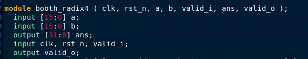
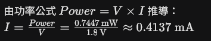

# Layout Pre-sim — Pad Count

以booth radix4 為top_module 為例

17. output bit,core power=0.7447mW)

1.  **決定 Signal Pad 的種類與數量  
    (33 output bit)**

- **Input Pad**：若無特殊需求，通常選用單一標準種類（如
  PDDDGZ）。

- **Output Pad**：需依據電流推動能力進行選擇（如
  PDO12CDG、PDO16CDG、PDO24CDG
  等）。電流越大推動力越強，能降低最後一級的訊號延遲（delay），但代價是會需要更多的
  IO Power Pad。設計時必須在此進行取捨。

> 好的，用 17 個
> **PDO16CDG**，我們可以參考[<u>網頁中</u>](https://timsnote.wordpress.com/2017/08/09/pad-selection/)提供的範例數據（假設
> C=40pF, L=6.5nH 時，**PDO16CDG 的 DF 值為 0.725**）來進行計算：

- **DF 值總和**：33 x 0.725 = 23.925

- **IO VDD Pad 數**：23.925 / 1.6 = 14.95 （無條件進位 ➔ **15** 個）

- **IO VSS Pad 數**：23.925 / 1.5 = 15.95 （無條件進位 ➔ **16** 個）

- **POC Pad 數**：**1** 個（每個 Power Domain 固定 1 個）

> **因此，若使用 33 個 PDO16CDG，您將會需要 15 個 IO
> VDD Pad、16 個 IO VSS Pad 以及
> 1 個 POC Pad。**

2.  **計算 IO Power Pad 數量  
    (power.rep =\> core power=0.7447mW  
    core VDD=1.8V )**

IO Power Pad 是用來供應 Signal Pad 電源的，其數量取決於前一步驟所選擇的
**Signal Output Pad**。

- **計算 DF 值總和**：利用文件查表並透過內插法，算出所選 Output Pad 的
  DF (Driving Factor) 值，再乘上該 Pad 的總使用數量。

- **計算 VDD / VSS Pad 數**：將 DF 值總和分別除以對應的 driving
  參數（例如 Non-SSO 種類除以 1.6 與
  1.5），計算出來後**無條件進位取整數**，即為所需的 IO VDD 與 IO VSS Pad
  數量。

- **配置 POC Pad**：在每個 Power Domain 中，必須且只能額外加入一個
  Power-on Control (POC) Pad 作為電源總開關。

### 1. 計算 Core 所需總電流

### 2. 計算所需的最少 Pad 數量

接下來，必須將總電流除以單一個 Core Power Pad 的最大承受電流（需查閱
Release Note 內的 EM Table）。

雖然您目前沒有提供 T18 製程中 Core VDD/VSS Pad
的最大電流上限，但我們可以參考網頁中的範例：一般的 Power Pad
最大電流通常在 30 mA到 90 mA之間。

- **理論需求量**：因為您的總電流只有約 0.4137 mA，遠小於 Pad
  的電流上限，所以不論 VDD 還是 VSS，理論上算出來都會是 0.01
  左右，無條件進位後只需 **1 組** Core Power
  Pad 就足夠供電。

<!-- -->

- **Core VSS Pad (如 PVSS1DGZ)**：**4 個**

**三、 評估 Core Power Pad 數量**

Core Power Pad 用於連接晶片內部的 Power Ring 以供應整個 Core
的電源，數量取決於整體功耗。

- **計算基本需求量**：先將預估的 Core Power 除以 Core 運作電壓 (V)
  得出所需總電流，再除以單一 Core Power Pad
  的最大電流上限，算出最少需要的 Pad 組數。

- **考量平衡擺放**：在實際佈局（Floorplan）時，為了維持晶片供電的穩定性與對稱性，會盡量讓四個邊的
  Pad 數量保持平均。因此，即使計算出的需求量很少（例如只需 1
  組），通常仍會在四個邊各放置 1 組。

實務在做晶片佈局（Floorplan）時，為了讓整個 Core 外圈的 Power Ring
供電穩定且平均，**必須考量平衡擺放的問題（四個邊放的數量差不多）**。

**結論：**

即便您的電路極度省電，理論上只需要 1 組
Pad，但在實際下線設計時，通常會在晶片的四個邊各放一組。因此，您最終的
Core Power Pad 數量為：

- **Core VDD Pad (如 PVDD1DGZ)**：**4 個**

### 四、 總 Pad 數量總結

經過重新評估後，您這顆晶片總共會需要 **112 個 Pad**，清單如下：

- **訊號腳位 (68 個)**：35 個 Input Pad + 33 個 Output Pad

- **IO 電源 (32 個)**：15 個 IO VDD + 16 個 IO VSS + 1 個 POC

- **Core 電源 (8 個)**：4 個 Core VDD + 4 個 Core VSS

- **角落腳位 (4 個)**：4 個 Corner Pad (這 4
  個通常佈局在晶片四個角落，用於連接四邊的 Power Ring)
